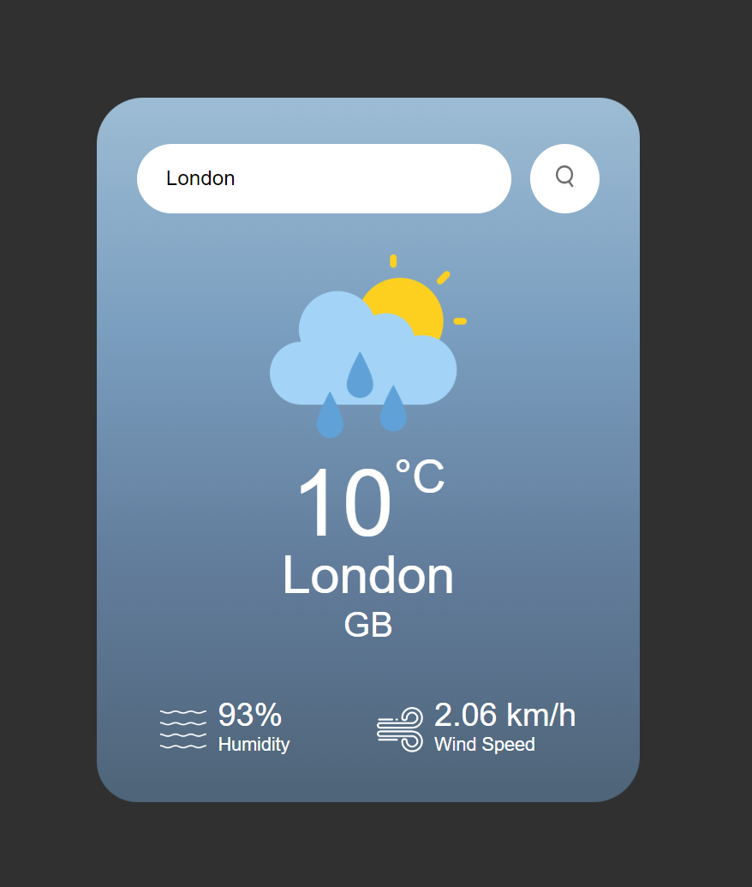

# Weather-App-JS
## Introduction
This repository contains the source code for a simple yet elegant weather application. The app allows users to search for weather conditions in any city. It provides real-time weather information including temperature, humidity, and wind speed.

## Features
1. Search for weather by city name.
2. Displays temperature, humidity, wind speed, and weather icon.
3. Error handling for invalid city names.
4. Dynamic weather icons and background colors based on current weather conditions.

## Technologies
1. HTML
2. CSS
3. JavaScript
4. OpenWeatherMap API

## Setup
1. Clone the repository to your local machine.
2. Visit OpenWeatherMap and create an account:
   * Navigate to the API keys section in your account
   * Generate a new API key and replace the placeholder "YOUR_API_KEY_HERE" in the 'script.js' file. (It may take a little while for the key to become active).
3. Open the index.html file in a browser to view the app.

## Usage
1. Enter the name of a city in the search box.
2. Click the search button to view the weather details of the entered city.

## Screenshot

## Code Structure
1. HTML
   * The HTML file (index.html) structures the web application. It includes a search box, error message display section, and a weather display section.
2. CSS
   * The CSS file (style.css) styles the application. It includes styling for the card layout, search box, error messages, weather details, and responsive design.
3. JavaScript
   * The JavaScript file (script.js) contains the logic for fetching weather data from the OpenWeatherMap API. It updates the DOM with the fetched data and handles the dynamic changes in the UI based on the weather conditions.
